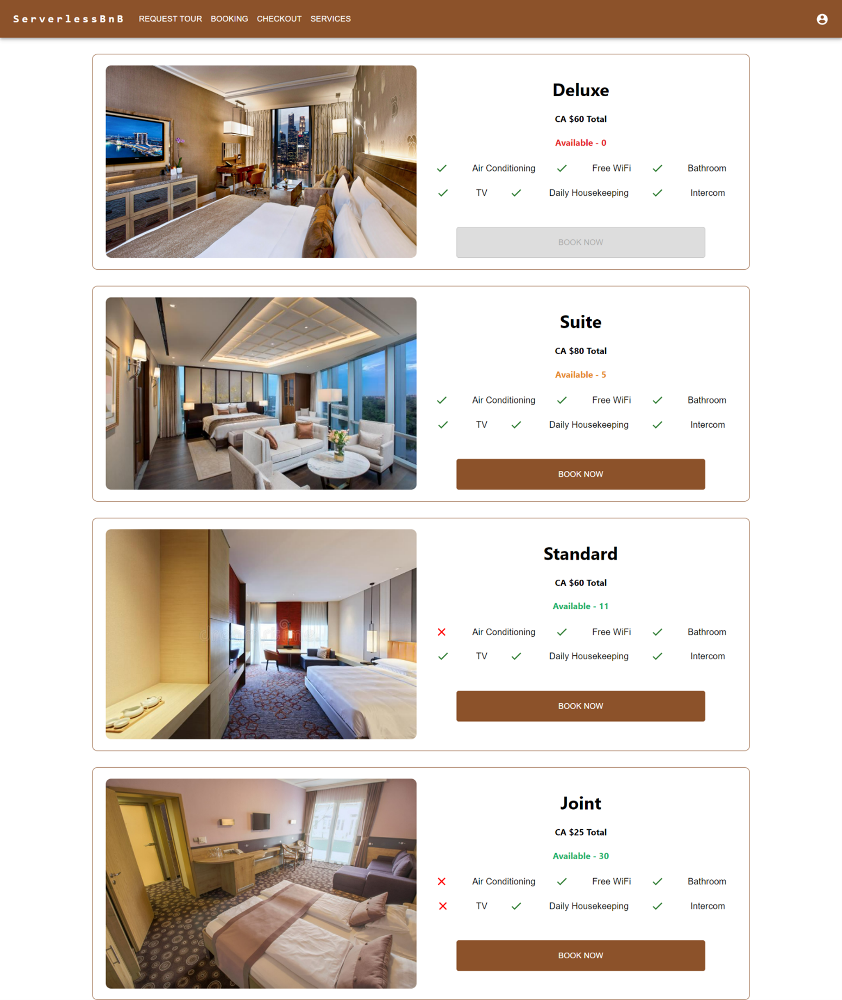

# ServerlessBnB

## Project and Architecture Overview

The Serverless Bed & Breakfast is a cloud-based hotel reservation system. This system provides the facility to reserve hotel accommodation, order food from the restaurant and allows customers to request a personalized trip package from the tour operator. Customers, Hotel Management, Kitchen, and Tour Operators are the four primary components of this system. Customers must register or login to use the other services provided by the application. Furthermore, customer oversees communicating with other services to register feedback, book tours, and place food orders etc. Users may also get online help with website navigation, room availability, booking management, and ordering food from the restaurant. Customers may use the Hotel Management service to book rooms or beds and engage with the kitchen to acknowledge their service. Kitchen service oversees taking customer orders, sending bills to hotel management, and preparing meals (only breakfast). Meal preparation necessitates inventory access, cooking, scheduling, and order management. The application also provides tour operator services which offers customers with a customized tour package. It also sends out created tour package information to customers through email.

Serverless B & B follows multi-cloud architecture paradigm by using Google Cloud Platform (GCP) and Amazon Web Services (AWS). This ensures application's high availability. The static assets generated by the React frontend of our application are hosted in an S3 bucket on AWS, where the application is deployed. This makes it possible for users to access the application online. The user data and application must be kept on Cloud FireStore and Amazon DynamoDB, two services that, among other things, offer user registration and multi-factor user authentication. Using Amazon Cognito, which is supported by the DynamoDB and FireStore databases, users are authorised and managed.

The virtual help system for the application is run by Amazon Lex, which uses AWS Lambda functions to fulfil user requests while utilising the DynamoDB data. Most of the application's logical processing is handled by AWS Lambda Functions and Google Cloud Functions, which replace the traditional server-oriented design. The Google Cloud Pub/Sub service, which facilitates communication and the concurrent processing of requests throughout the application, supports this processing. Through the API Gateway service offered by both the GCP and AWS cloud providers, these cloud services are safely made available to the application. To create personalised tour packages and analyse client input, the application employs machine learning methods offered by GCP, more notably the Vertex AI and NLP API services. Reports on user login statistics are produced using the cloud services provided by Amazon CloudTrail and Cloudwatch.

## Core Components

The application is developed using the below mentioned AWS and GCP services:

| Module                             |                            Services                             |
| ---------------------------------- | :-------------------------------------------------------------: |
| User Management                    |    AWS: Cognito, Lambda, DynamoDB, API Gatewa GCP: Firestore    |
| Authentication                     | AWS: Cognito, DynamoDB, Lambda, GCP: Cloud Functions, Firestore |
| Online Support                     |                 AWS: S3, Lex, Lambda, DynamoDB                  |
| Message Passing                    |            GCP: Cloud functions, Pub/Sub, Firestore             |
| Machine Learning                   |                     GCP: NLP API, Vertex AI                     |
| Web Application Building & Hosting |                 React and GitLab CI/CD, AWS S3                  |
| Other Essential Modules            |                   AWS: CloudTrail, CloudWatch                   |

## Serverless B&B Application Architecture

## User Registration Flow Diagram

## User Authentication Flow Diagram

## Interaction Diagram for Kitchen Service

## Booking and Searching Rooms User Flow Diagram

## Screenshots

